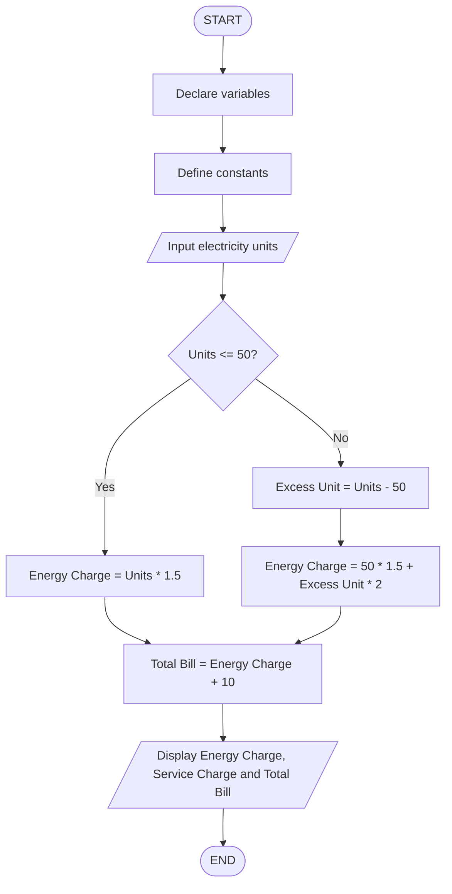

# Electricity Bill Flowchart

```mermaid
flowchart TD
    A([START]) --> B[Declare variables]
    B --> C[Define constants]
    C --> D[/Input electricity units/]
    D --> E{Units <= 50?}

    E -->|Yes| F[Energy Charge = Units * 1.5]
    E -->|No| G[Excess Unit = Units - 50]

    G --> H[Energy Charge = 50 * 1.5 + Excess Unit * 2]

    F --> I[Total Bill = Energy Charge + 10]
    H --> I

    I --> J[/Display Energy Charge, Service Charge and Total Bill/]
    J --> K([END])
```
