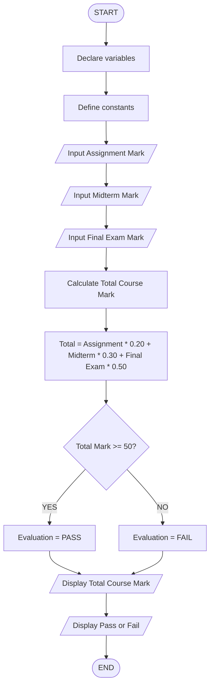

# Course Mark Evaluation Flowchart

```mermaid
flowchart TD
    A([START]) --> B[Declare variables]
    B --> C[Define constants]
    C --> D[/Input Assignment Mark/]
    D --> E[/Input Midterm Mark/]
    E --> F[/Input Final Exam Mark/]

    F --> G[Calculate Total Course Mark]

    G --> H["Total = Assignment * 0.20 + Midterm * 0.30 + Final Exam * 0.50"]

    H --> I{Total Mark >= 50?}

    I -->|YES| J[Evaluation = PASS]
    I -->|NO| K[Evaluation = FAIL]

    J --> L[/Display Total Course Mark/]
    K --> L

    L --> M[/Display Pass or Fail/]
    M --> N([END])
```
