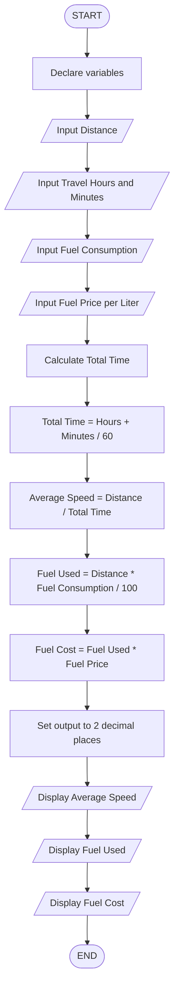

# Travel Distance and Fuel Cost Flowchart

```mermaid
flowchart TD
    A([START]) --> B[Declare variables]
    B --> C[/Input Distance/]
    C --> D[/Input Travel Hours and Minutes/]
    D --> E[/Input Fuel Consumption/]
    E --> F[/Input Fuel Price per Liter/]

    F --> G[Calculate Total Time]
    G --> H["Total Time = Hours + Minutes / 60"]

    H --> I["Average Speed = Distance / Total Time"]
    I --> J["Fuel Used = Distance * Fuel Consumption / 100"]
    J --> K["Fuel Cost = Fuel Used * Fuel Price"]

    K --> L[Set output to 2 decimal places]

    L --> M[/Display Average Speed/]
    M --> N[/Display Fuel Used/]
    N --> O[/Display Fuel Cost/]

    O --> P([END])
```
